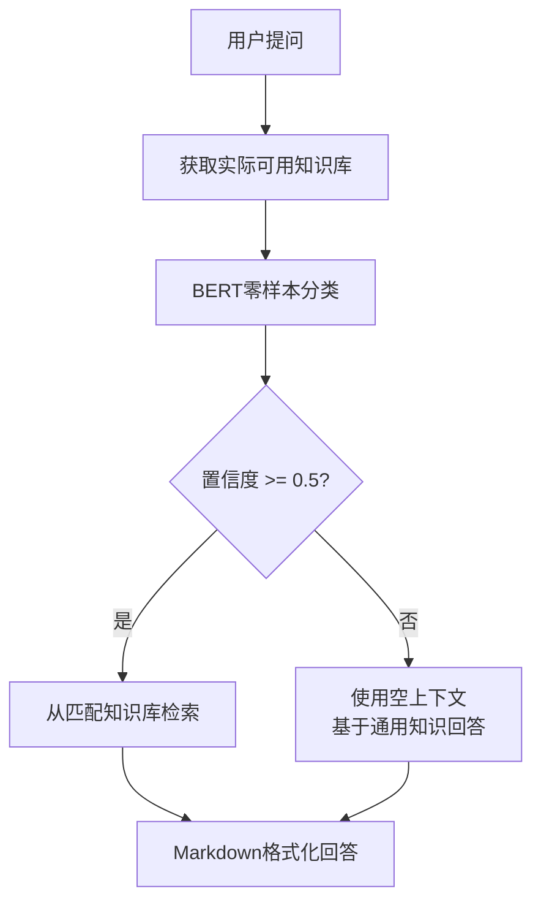

# interview_ai_agents

一个基于AI Agent架构的Java后端面试知识智能问答系统，支持自定义知识库构建、智能意图识别和多轮对话。

## 🌟 项目特色

- **🧠 智能意图识别**：基于BERT零样本分类，动态识别用户实际创建的知识库
- **📚 自定义知识库**：支持上传PDF文档构建专属知识库（如计算机网络、Java面试题等）
- **🤖 AI驱动回答**：集成阿里云通义千问，提供专业的技术面试回答
- **💬 多轮对话**：支持上下文记忆的连续对话体验
- **🎨 美观界面**：现代化Web界面，支持Markdown渲染和代码高亮
- **📊 透明决策**：显示AI置信度、匹配知识库等元数据信息

## 🏗️ 系统架构

```
├── app/                    # 主应用模块
│   ├── main.py            # FastAPI应用入口
│   └── frontend/          # 前端文件
│       ├── templates/     # HTML模板
│       └── static/        # 静态资源（CSS/JS）
├── knowledge_base/        # 知识库管理
│   └── knowledge_manager.py
├── intent_recognition/    # 意图识别
│   └── intent_classifier.py
├── answer_generation/     # 答案生成
│   └── ali_qianwen.py
├── plugins/              # 插件扩展
│   └── google_search.py
└── utils/               # 工具函数
    └── language_support.py
```

## 🚀 快速开始

### 环境要求

- Python 3.8+
- pip

### 安装依赖

```bash
pip install -r requirements.txt
```

### 配置API密钥

创建 `.env` 文件：

```bash
DASHSCOPE_API_KEY=your_qianwen_api_key_here
```

### 启动服务

```bash
uvicorn app.main:app --reload --host 0.0.0.0 --port 8081
```

### 访问系统

打开浏览器访问：`http://localhost:8081`

## 📖 使用指南

### 1. 创建知识库

- 点击左侧边栏的"+"按钮
- 输入知识库名称（如"计算机网络"、"Java面试题"）
- 确认创建

### 2. 上传PDF文档

- 选择目标知识库
- 点击"上传PDF"按钮
- 选择本地PDF文件或输入服务器文件路径
- 系统自动进行文档解析和向量化存储

### 3. 智能问答

- 在输入框中输入问题
- 系统自动进行意图识别，匹配相关知识库
- AI基于检索到的上下文生成专业回答
- 支持Markdown格式显示，包含代码高亮

## 🔧 核心技术

- **后端框架**：FastAPI
- **AI模型**：阿里云通义千问 (qwen-turbo)
- **意图识别**：Hugging Face BERT (facebook/bart-large-mnli)
- **向量数据库**：FAISS
- **文档解析**：PyPDF2
- **文本分割**：LangChain RecursiveCharacterTextSplitter
- **前端技术**：HTML5 + Bootstrap 5 + Vanilla JavaScript # 由AI生成

## 📅 更新日志

### 2025-08-13 更新

#### 🎯 核心改进

**1. 动态知识库识别**：
- ❌ 原来：硬编码的知识库类别映射
- ✅ 现在：直接基于用户实际创建的知识库进行识别

**2. 置信度控制**：
- ✅ 置信度阈值：0.5
- ✅ 低置信度时使用空上下文（通用知识回答）
- ✅ 高置信度时从对应知识库检索

**3. 简洁的逻辑**：
- ✅ 移除了复杂的别名映射表
- ✅ 移除了硬编码的规则匹配
- ✅ 直接使用BERT对实际知识库进行分类

**4. 本地文件上传**：
- ✅ 支持浏览器直接选择本地PDF文件
- ✅ 文件大小验证（50MB限制）
- ✅ 实时上传进度显示
- ✅ 自动临时文件清理

**5. 回答格式化优化**：
- ✅ 标准Markdown格式输出
- ✅ 代码块语法高亮
- ✅ 专业的样式排版
- ✅ 元数据信息展示（置信度、知识库、上下文长度）

#### 🔄 工作流程优化



## 📋 API文档

### 知识库管理

```bash
# 获取所有知识库
GET /knowledge_bases

# 创建知识库
POST /create_kb
Content-Type: application/json
{"name": "知识库名称"}

# 删除知识库
DELETE /delete_kb/{kb_name}

# 上传PDF文件
POST /upload_pdf/
Content-Type: multipart/form-data
file: PDF文件
knowledge_base_name: 目标知识库名称
```

### 问答接口

```bash
# 智能问答
GET /ask/?question=你的问题

# 返回格式
{
    "answer": "AI回答内容",
    "confidence": 0.85,
    "matched_kbs": ["匹配的知识库"],
    "context_length": 1024
}
```

## 🎨 界面预览

### 主界面
- 左侧：知识库管理面板
- 右侧：对话交互区域
- 底部：问题输入框

### 功能特色
- 📱 响应式设计，支持移动端
- 🎯 实时加载状态提示
- 📊 AI决策过程透明化显示
- 💻 代码块深色主题高亮

## 🔍 技术细节

### 意图识别算法

```python
def recognize_intent_with_available_kbs(question: str, available_kbs: list) -> tuple:
    """
    基于实际可用知识库进行意图识别
    返回：(匹配的知识库列表, 置信度)
    """
    # 使用BERT进行零样本分类
    result = classifier(
        question,
        candidate_labels=available_kbs,  # 实际知识库作为候选标签
        multi_label=True
    )
    
    # 过滤高置信度结果
    high_confidence_kbs = [
        label for label, score in zip(result['labels'], result['scores'])
        if score >= CONFIDENCE_THRESHOLD
    ]
    
    return high_confidence_kbs, avg_confidence
```

### RAG实现

```python
def search_knowledge_base(query: str, knowledge_base_name: str, top_k: int = 5):
    """从指定知识库检索相关文档"""
    results = vector_store.similarity_search(
        query, 
        k=top_k,
        filter={"knowledge_base": knowledge_base_name}
    )
    return results
```

## 🛠️ 开发计划

- [ ] **多轮对话支持**：添加对话历史记忆
- [ ] **知识库统计**：文档数量、来源分析
- [ ] **搜索优化**：混合检索（关键词+向量）
- [ ] **用户管理**：多用户隔离
- [ ] **插件系统**：Google搜索集成
- [ ] **性能优化**：缓存机制、异步处理

## 🤝 贡献指南

1. Fork本项目
2. 创建特性分支 (`git checkout -b feature/AmazingFeature`)
3. 提交更改 (`git commit -m 'Add some AmazingFeature'`)
4. 推送到分支 (`git push origin feature/AmazingFeature`)
5. 开启Pull Request

## 📄 许可证

本项目采用 MIT 许可证 - 查看 [LICENSE](LICENSE) 文件了解详情

## 🙏 致谢

- [阿里云通义千问](https://dashscope.aliyun.com/) - AI回答生成
- [Hugging Face](https://huggingface.co/) - 意图识别模型
- [FAISS](https://faiss.ai/) - 向量相似度检索
- [FastAPI](https://fastapi.tiangolo.com/) - 现代Python Web框架
- [Bootstrap](https://getbootstrap.com/) - 前端UI框架

---

**📧 联系方式**: 如有问题或建议，欢迎提Issue或Pull Request

**🌟 如果觉得项目有帮助，请给个Star支持一下！**